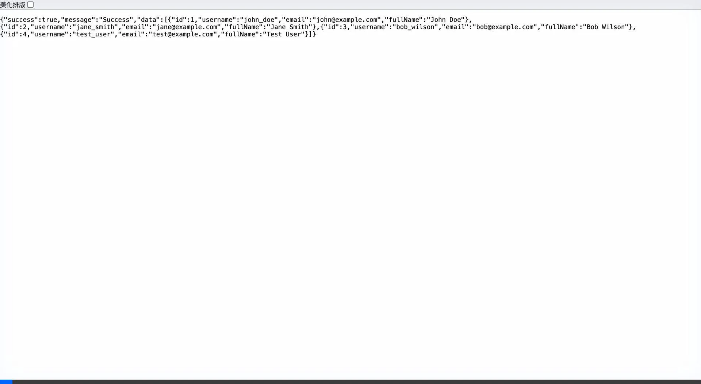
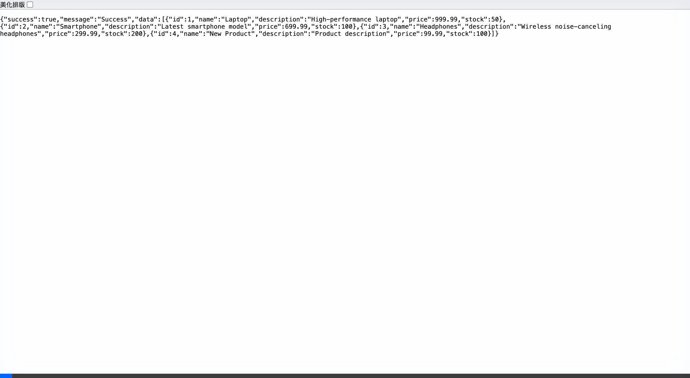

# PostgreSQL + Spring Boot + FastAPI 專案執行成果報告

> 執行時間：2025-12-04
> 執行環境：macOS (ARM64)

---

## 📋 目錄

1. [專案概述](#專案概述)
2. [環境準備與啟動](#環境準備與啟動)
3. [服務狀態驗證](#服務狀態驗證)
4. [API 測試結果](#api-測試結果)
5. [Swagger 文件](#swagger-文件)
6. [停止服務](#停止服務)
7. [測試總結](#測試總結)

---

## 專案概述

本專案為三層架構整合專案，包含：

```
┌─────────────────┐     ┌──────────────────┐     ┌─────────────────┐
│  Python FastAPI │────▶│ Java Spring Boot │────▶│   PostgreSQL    │
│   (Port 8000)   │     │   (Port 8080)    │     │   (Port 5432)   │
└─────────────────┘     └──────────────────┘     └─────────────────┘
       Gateway              Backend API              Database
```

| 元件 | 技術棧 | 連接埠 |
|------|--------|--------|
| API Gateway | Python 3.11 + FastAPI | 8000 |
| Backend API | Java 17 + Spring Boot 3.2 | 8080 |
| Database | PostgreSQL 15 | 5432 |

---

## 環境準備與啟動

### 步驟 1：啟動 Docker Desktop

```bash
open -a Docker
```

### 步驟 2：使用 Docker Compose 啟動所有服務

```bash
docker compose up -d --build
```

### 執行結果

所有三個容器成功啟動：

| 容器名稱 | 狀態 | 連接埠映射 |
|----------|------|------------|
| `postgres-db` | Up (healthy) | 0.0.0.0:5432→5432/tcp |
| `spring-boot-api` | Up | 0.0.0.0:8080→8080/tcp |
| `fastapi-gateway` | Up | 0.0.0.0:8000→8000/tcp |

---

## 服務狀態驗證

### FastAPI Gateway 健康檢查

**請求：**
```bash
curl http://localhost:8000/health
```

**回應：**
```json
{
  "status": "UP",
  "service": "FastAPI Gateway",
  "backend_url": "http://spring-boot-api:8080"
}
```

### Spring Boot Backend 健康檢查

**請求：**
```bash
curl http://localhost:8000/health/backend
```

**回應：**
```json
{
  "service": "Spring Boot API",
  "status": "UP",
  "timestamp": 1764838159386
}
```

---

## API 測試結果

### 使用者 API

#### 1. 取得所有使用者

**請求：**
```bash
curl http://localhost:8000/api/users
```

**回應：**
```json
{
  "success": true,
  "message": "Success",
  "data": [
    {
      "id": 1,
      "username": "john_doe",
      "email": "john@example.com",
      "fullName": "John Doe"
    },
    {
      "id": 2,
      "username": "jane_smith",
      "email": "jane@example.com",
      "fullName": "Jane Smith"
    },
    {
      "id": 3,
      "username": "bob_wilson",
      "email": "bob@example.com",
      "fullName": "Bob Wilson"
    }
  ]
}
```

#### 2. 建立新使用者

**請求：**
```bash
curl -X POST http://localhost:8000/api/users \
  -H "Content-Type: application/json" \
  -d '{
    "username": "test_user",
    "email": "test@example.com",
    "fullName": "Test User"
  }'
```

**回應：**
```json
{
  "success": true,
  "message": "User created successfully",
  "data": {
    "id": 4,
    "username": "test_user",
    "email": "test@example.com",
    "fullName": "Test User"
  }
}
```

---

### 產品 API

#### 1. 取得所有產品

**請求：**
```bash
curl http://localhost:8000/api/products
```

**回應：**
```json
{
  "success": true,
  "message": "Success",
  "data": [
    {
      "id": 1,
      "name": "Laptop",
      "description": "High-performance laptop",
      "price": 999.99,
      "stock": 50
    },
    {
      "id": 2,
      "name": "Smartphone",
      "description": "Latest smartphone model",
      "price": 699.99,
      "stock": 100
    },
    {
      "id": 3,
      "name": "Headphones",
      "description": "Wireless noise-canceling headphones",
      "price": 299.99,
      "stock": 200
    }
  ]
}
```

#### 2. 建立新產品

**請求：**
```bash
curl -X POST http://localhost:8000/api/products \
  -H "Content-Type: application/json" \
  -d '{
    "name": "New Product",
    "description": "Product description",
    "price": 99.99,
    "stock": 100
  }'
```

**回應：**
```json
{
  "success": true,
  "message": "Product created successfully",
  "data": {
    "id": 4,
    "name": "New Product",
    "description": "Product description",
    "price": 99.99,
    "stock": 100
  }
}
```

#### 3. 搜尋產品

**請求：**
```bash
curl "http://localhost:8000/api/products/search?name=laptop"
```

**回應：**
```json
{
  "success": true,
  "message": "Success",
  "data": [
    {
      "id": 1,
      "name": "Laptop",
      "description": "High-performance laptop",
      "price": 999.99,
      "stock": 50
    }
  ]
}
```

---

## Swagger 文件

FastAPI 自動生成的 Swagger 文件可透過以下網址存取：

- **Swagger UI**: http://localhost:8000/docs
- **ReDoc**: http://localhost:8000/redoc

### Swagger 文件截圖

以下是 Swagger 文件頁面的操作錄影：


### API 回應示範

#### 使用者 API 回應



#### 產品 API 回應




## 停止服務

如需停止所有服務，請執行：

```bash
# 停止所有容器
docker compose down

# 停止並刪除資料卷（會清除資料庫資料）
docker compose down -v
```

---

## 測試總結

| 測試項目 | 狀態 |
|----------|------|
| Docker Compose 啟動 | ✅ 成功 |
| PostgreSQL 連線 | ✅ 成功 |
| Spring Boot API 啟動 | ✅ 成功 |
| FastAPI Gateway 啟動 | ✅ 成功 |
| 健康檢查 API | ✅ 成功 |
| 使用者 API - 查詢 | ✅ 成功 |
| 使用者 API - 建立 | ✅ 成功 |
| 產品 API - 查詢 | ✅ 成功 |
| 產品 API - 建立 | ✅ 成功 |
| 產品 API - 搜尋 | ✅ 成功 |
| Swagger 文件存取 | ✅ 成功 |

**所有測試項目均通過！專案可正常運作。**
